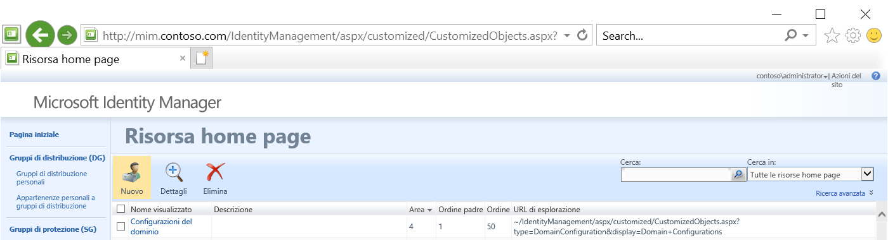
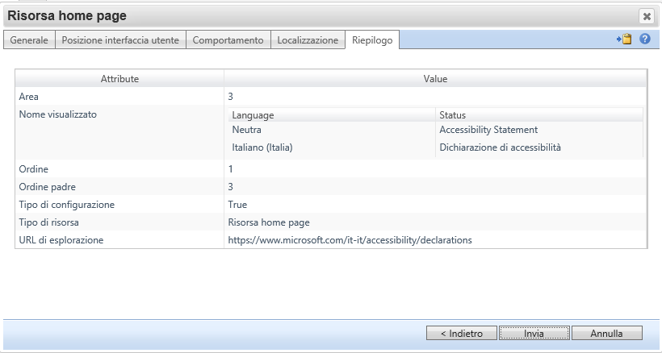
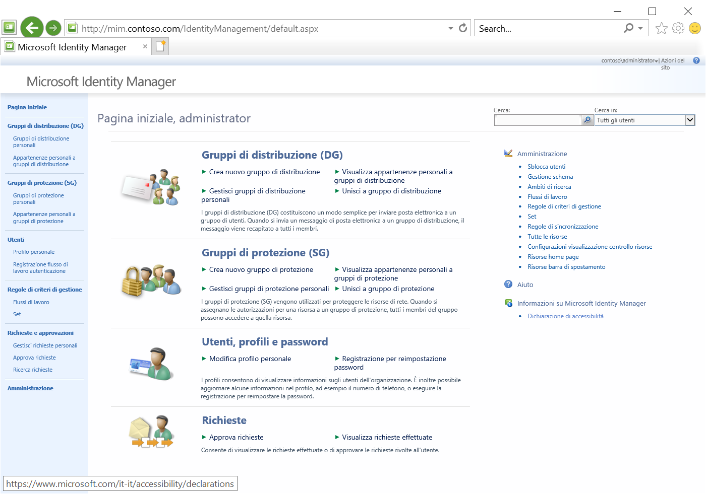

---
# required metadata

title: Update MIM Portals with links to accessibility statements | Microsoft Docs
description: This article documents how customers that are subject to accessibility requirements can add links to their existing MIM Portal, SSPR registration and reset web sites.
keywords:
author: markwahl-msft
ms.author: mwahl
manager: billmath
ms.date: 10/20/2022
ms.topic: reference
ms.prod: microsoft-identity-manager

ms.assetid:

---

# Update MIM portals with links to accessibility statements

[Microsoft Accessibility Conformance Reports](https://www.microsoft.com/accessibility/conformance-reports) describe how products and services, including MIM, support recognized global accessibility standards.

If your organization uses MIM end user self-service features, through the MIM Portal or password reset portals, you may be required by the regulatory frameworks for your organization to include links for accessibility statements in some of the web experiences you provide to your end users.  As your MIM deployment may be customized, with changes that add new user interface elements to those portals, your accessibility statement for your customized MIM-derived user experiences might be specific to your deployment.

This article illustrates how to add links for accessibility statements to the home page of the MIM portal.

## Updating MIM Portal

You can choose where to add links on the MIM Portal. For example, to add a new item to the home page, follow these steps.

1. From the MIM Portal home page, click on Administration.

1. Click on Home Page Resources.

   

1. Click New.

1. In Display Name, type the text of the link.  For example, for France, the link text might be `Accessibilité: partiellement conforme`, and for Italy, the link text might be `Dichiarazione di accessibilità` or `Accessibilità`.

1. In Usage Keyword, type `BasicUI`.

1. Click Next.

1. In Region, select Right region of home page.

1. In Parent Order, type 3.

1. In Order, type 1, or a larger number if you have already added links to that area.

1. Click Next.

1. In Navigation URL, paste the URL.  For example, if this is an unmodified MIM Portal and you're linking to the Microsoft accessibility statements for France, the URL would be `https://www.microsoft.com/fr-fr/accessibility/accessibilite/accessibility-statement`. If this is an unmodified MIM Portal and you're linking to the Microsoft accessibility declarations for Italy, the URL would be `https://www.microsoft.com/it-it/accessibility/declarations`.  If you've customized the MIM Portal with your own user interface elements, then provide a URL that links to your own organization's accessibility statement or declaration.

1. In Localization, provide the localized text of the link.

1. Click Finish, and then click Submit.

 

1. Click Start, click Run, and then type `iisreset`.

1. Refresh your browser cache and reload the home page of the MIM Portal.

   

For adding links to other areas of the MIM Portal, the [introduction to configuring and customizing the FIM Portal](/previous-versions/mim/ee534913(v=ws.10)) also applies to the MIM Portal as well.

## Self-Service Password Reset

For customers that are [licensed for Azure Active Directory Premium](/azure/active-directory/authentication/concept-sspr-licensing), we recommend using [Azure AD self-service password reset](/azure/active-directory/authentication/concept-sspr-howitworks) (SSPR) to provide the end-user experience.  Azure AD self-service password reset provides both a web-based and Windows-integrated experience for a user to reset their own password, and supports many of the same capabilities as MIM.

For customers that haven't yet deployed Azure AD self-service password reset for their users, and are still using the MIM password reset and registration portals, the [self-service password reset portal customization guide](/reference/mim-portal-customizations) lists the strings and CSS that can be changed. The [test lab guide for Password Registration and Reset Portal Customization](/previous-versions/mim/hh877809(v=ws.10)) from FIM 2010 R2 also applies to customizing MIM 2016 deployments of the password reset and registration portals as well.

## Next steps

* [Working with Self-Service Password Reset](working-with-self-service-password-reset.md)
* [Resources for building accessible web sites](/microsoft-edge/accessibility/build/)
