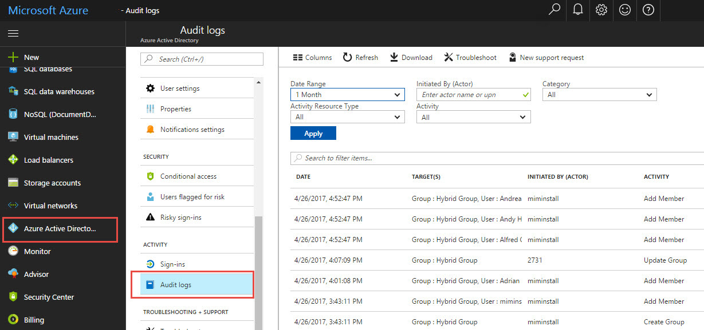

---
# required metadata

title: Work with hybrid reporting in Azure with Identity Manager 2016  | Microsoft Docs
description: Learn how to combine on-premises and cloud data into hybrid reports in Azure, and how to manage and view these reports.
keywords:
author: fimguy
ms.author: barclayn
manager: mbaldwin
ms.date: 10/12/2017
ms.topic: article
ms.service: microsoft-identity-manager
ms.technology: security
ms.assetid: 68df2817-2040-407d-b6d2-f46b9a9a3dbb

# optional metadata

#ROBOTS:
#audience:
#ms.devlang:
ms.reviewer: mwahl
ms.suite: ems
#ms.tgt_pltfrm:
#ms.custom:

---

# Work with hybrid reporting in Identity Manager Public Preview refresh

This article discusses how to combine on-premises and cloud data into hybrid reports in Azure, and how to manage and view these reports.

## Available hybrid reports
The first three Microsoft Identity Manager reports available in Azure Active Directory (Azure AD) are as follows:

- **Password reset activity**: Displays each instance when a user performed password reset using self-service password reset (SSPR) and provides the gates or methods used for authentication.

- **Password reset registration**: Displays each time that a user registers for SSPR and the methods used to authenticate. Examples of methods might be a mobile phone number or questions and answers.
   > [!NOTE]
   > For *Password reset registration* reports, no differentiation is made between SMS gate and MFA gate. Both are considered mobile phone methods.

- **Self-service groups activity**: Displays each attempt made by someone to add or delete him or herself from a group and group creation.

    

> [!NOTE]
> * The reports currently present data for up to one month of activity.
> * The previous hybrid agent must be uninstalled.
> * To uninstall hybrid reports, uninstall the MIMreportingAgent.msi agent.

## Prerequisites

* Microsoft Identity Manager 2016 RTM or the SP1 Identity Manager service.

* An Azure AD Premium tenant with a licensed administrator in your directory.

* Outgoing internet connectivity from the Microsoft Identity Manager server to Azure.

## Requirements
The requirements for using Microsoft Identity Manager hybrid reporting are listed in the following table:

| Requirement | Description |
| --- | --- |
| Azure AD Premium | Hybrid reporting is an Azure AD Premium feature and requires Azure AD Premium.  For more information, see [Getting started with Azure AD Premium](https://docs.microsoft.com/azure/active-directory/active-directory-get-started-premium).  Get a [free 30-day trial of Azure AD Premium](https://azure.microsoft.com/trial/get-started-active-directory/). |
| You must be a global administrator of your Azure AD |By default, only global administrators can install and configure the agents to get started, access the portal, and perform any operations within Azure.  **Important**: The account that you use when you install the agents must be a work or school account. It cannot be a Microsoft account. For more information, see [Sign up for Azure as an organization](https://docs.microsoft.com/azure/active-directory/sign-up-organization). |
| Microsoft Identity Manager Hybrid Agent is installed on each targeted Identity Manager Service server | To receive the data and provide monitoring and analytics capabilities, hybrid reporting requires the agents to be installed and configured on targeted servers.   |
| Outbound connectivity to the Azure service endpoints | During installation and runtime, the agent requires connectivity to Azure service endpoints. If outbound connectivity is blocked by firewalls, ensure that the following endpoints are added to the allowed list:<ul><li>\*.blob.core.windows.net </li><li>\*.servicebus.windows.net - Port: 5671 </li><li>\*.adhybridhealth.azure.com/</li><li>https://management.azure.com </li><li>https://policykeyservice.dc.ad.msft.net/</li><li>https://login.windows.net</li><li>https://login.microsoftonline.com</li><li>https://secure.aadcdn.microsoftonline-p.com</li></ul> |
|Outbound connectivity based on IP addresses | For IP addresses based filtering on firewalls, refer to the [Azure IP Ranges](https://www.microsoft.com/download/details.aspx?id=41653).|
| SSL inspection for outbound traffic is filtered or disabled | The agent registration step or data upload operations might fail if there is SSL inspection or termination for outbound traffic at the network layer. |
| Firewall ports on the server that runs the agent | To communicate with the Azure service endpoints, the agent requires the following firewall ports to be open:<ul><li>TCP port 443</li><li>TCP port 5671</li></ul> |
| Allow certain websites if Internet Explorer enhanced security is enabled |If IE enhanced security is enabled, the following websites must be allowed on the server that has the agent installed:<ul><li>https://login.microsoftonline.com</li><li>https://secure.aadcdn.microsoftonline-p.com</li><li>https://login.windows.net</li><li>The federation server for your organization trusted by Azure Active Directory (for example, https://sts.contoso.com).</li></ul> |
 

## Install Microsoft Identity Manager Reporting Agent in Azure AD
After Reporting Agent is installed, the data from Identity Manager activity is exported from Identity Manager to Windows Event Log. Identity Manager Reporting Agent processes the events and then uploads them to Azure. In Azure, the events are parsed, decrypted, and filtered for the required reports.

1.  Install Identity Manager 2016.

2.  Download Identity Manager Reporting Agent, and then do the following:

    a. Sign in to the Azure AD management portal, and then select **Active Directory**.

    b. Double-click the directory for which you are a global administrator and have an Azure AD Premium subscription.

    c. Select **Configuration**, and then download Reporting Agent.

3.  Install Reporting Agent by doing the following:

    a.  Download the [MIMHReportingAgentSetup.exe file](http://download.microsoft.com/download/7/3/1/731D81E1-8C1D-4382-B8EB-E7E7367C0BF2/MIMHReportingAgentSetup.exe) for the Identity Manager Service server.

    b.  Run `MIMHReportingAgentSetup.exe`. 

    c.  Run the agent installer.

    d.  Make sure that the Identity Manager Reporting Agent service is running.

    e.  Restart the Identity Manager service.

4.  Verify that Identity Manager Reporting Agent is working in Azure.

    You can create report data by using the Identity Manager self-service password reset portal to reset a user’s password. Make sure that the password reset was completed successfully, and then check to ensure that the data is displayed in the Azure AD management portal.

## View hybrid reports in the Azure portal

1.  Sign in to the [Azure portal](https://portal.azure.com/) with your global administrator account for the tenant.

2.  Select **Azure Active Directory**.

3.  In the list of available directories for your subscription, select the tenant directory.

4.  Select **Audit Logs**.

5.  In the **Category** drop-down list, make sure that **MIM Service** is selected.

> [!IMPORTANT]
> It can take some time for Identity Manager audit data to appear in the Azure portal.

## Stop creating hybrid reports
If you want to stop uploading reporting audit data from Identity Manager to Azure AD, uninstall the hybrid reporting agent. Use the Windows Add or Remove Programs tool to uninstall Identity Manager hybrid reporting.

## Windows events used for hybrid reporting
Events that are generated by Microsoft Identity Manager are stored in Windows Event Log. You can view the events in the **Event Viewer** by selecting **Application and Services logs** > **Identity Manager Request Log**. Each MIM request is exported as an event in Windows Event Log in JSON structure. You can export the result to your security information and event management (SIEM) system.

|Event type|ID|Event details|
|--------------|------|-----------------|
|Information|4121|The Identity Manager event data that includes all the request data.|
|Information|4137|The Identity Manager event 4121 extension, if there is too much data for a single event. The header in this event is displayed in the following format: `"Request: <GUID> , message <xxx> out of <xxx>`.|
