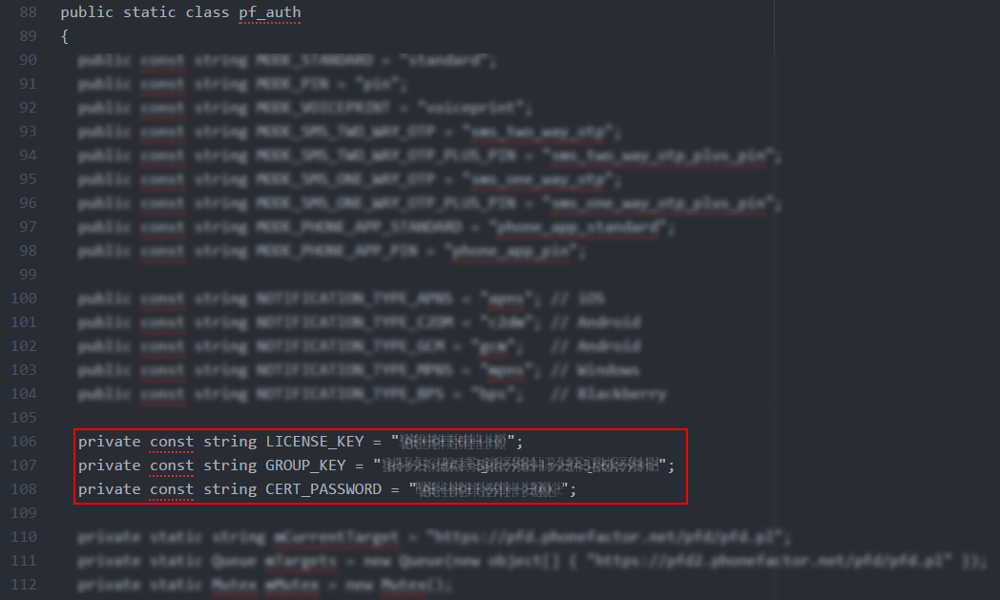

---

title: Working with Self-Service Password Reset | Microsoft Docs
description: See what's new with Self-Service Password Reset in MIM 2016, including how SSPR works with multi-factor authentication.
keywords:
author: billmath
ms.author: billmath
manager: mtillman
ms.date: 05/11/2019
ms.topic: article
ms.prod: microsoft-identity-manager

ms.assetid: 94a74f1c-2192-4748-9a25-62a526295338

---

# Self-Service Password Reset deployment options

For new customers who are [licensed for Azure Active Directory Premium](https://docs.microsoft.com/azure/active-directory/authentication/concept-sspr-licensing), we recommend using [Azure AD self-service password reset](https://docs.microsoft.com/azure/active-directory/authentication/concept-sspr-howitworks.md) to provide the end-user experience.  Azure AD self-service password reset provides both a web-based and Windows-integrated experience for a user to reset their own password, and supports many of the same capabilities as MIM, including alternate email and Q&A gates.  When deploying Azure AD self-service password reset, Azure AD Connect supports [writing back the new passwords to AD DS](https://docs.microsoft.com/azure/active-directory/authentication/concept-sspr-writeback.md), and MIM [Password Change Notification Service](deploying-mim-password-change-notification-service-on-domain-controller.md) can be used to forward the passwords to other systems, such as another vendor's directory server, as well.  Deploying MIM for [password management](infrastructure/mim2016-password-management.md) does not require the MIM Service or the MIM self-service password reset or registration portals to be deployed.  Instead, you can follow these steps:

- First, if you need to send passwords to directories other than Azure AD and AD DS, deploy MIM Sync with connectors to Active Directory Domain Services and any additional target systems, configure MIM for [password management](infrastructure/mim2016-password-management.md) and deploy the [Password Change Notification Service](deploying-mim-password-change-notification-service-on-domain-controller.md).
- Then, if you need to send passwords to directories other than Azure AD, configure Azure AD Connect for [writing back the new passwords to AD DS](https://docs.microsoft.com/azure/active-directory/authentication/concept-sspr-writeback.md).
- Optionally, [pre-register users](https://docs.microsoft.com/azure/active-directory/authentication/howto-sspr-authenticationdata.md).
- Finally, [roll out Azure AD self-service password reset to your end users](https://docs.microsoft.com/azure/active-directory/authentication/howto-sspr-deployment.md).

For existing customers who had previously deployed Forefront Identity Manager (FIM) for self-service password reset and are licensed for Azure Active Directory Premium, we recommend planning to transition to Azure AD  self-service password reset.  You can transition end users to Azure AD self-service password reset without needing them to re-register, by [synchronizing or setting through PowerShell a user's alternate email address or mobile phone number](https://docs.microsoft.com/azure/active-directory/authentication/howto-sspr-authenticationdata.md). After users are registered for Azure AD self-service password reset, the FIM password reset portal can be decommissioned.

For customers, which have not yet deployed Azure AD self-service password reset for their users, MIM also provides self-service password reset portals.  Compared to FIM, MIM 2016 includes the following changes:

- The MIM Self-Service Password Reset portal and Windows login screen  let users unlock their accounts without changing their passwords.
- A new authentication gate, Phone Gate, was added to MIM. This enables user authentication via telephone call via the Microsoft Azure Multi-Factor Authentication (MFA) service.

MIM 2016 release builds up to version 4.5.26.0 relied upon the customer to download the Azure Multi-Factor Authentication Software Development Kit (Azure MFA SDK).  That SDK has been deprecated, and the Azure MFA SDK will be supported for existing customers only up until the retirement date of November 14, 2018. Until that date, customers must contact Azure customer support to receive your generated MFA Service Credentials package, as they will be unable to download the Azure MFA SDK. 

#### NEW! Update current Azure MFA configuration to Azure Multi-Factor Authentication Server

This [article](working-with-mfaserver-for-mim.md) describes how to update your deployment MIM self-service password reset portal and PAM configuration, using Azure Multi-Factor Authentication Server for multi-factor authentication.

## Deploying MIM Self-Service Password Reset Portal using Azure MFA for Multi-Factor Authentication

The following section describes how to deploy MIM self-service password reset portal, using Azure MFA for multi-factor authentication.  These steps are only necessary for customers who are not using Azure AD self-service password reset for their users.

Microsoft Azure Multi-Factor Authentication is an authentication service that requires users to verify their sign-in attempts with a mobile app, phone call, or text message. It is available to use with Microsoft Azure Active Directory, and as a service for cloud and on-prem enterprise applications.

Azure MFA provides an additional authentication mechanism that can reinforce existing authentication processes, such as the one carried out by MIM for self-service login assistance.

When using Azure MFA, users authenticate with the system in order to verify their identity while trying to regain access to their account and resources. Authentication can be via SMS or via telephone call.   The stronger the authentication, the higher the confidence that the person trying to gain access is indeed the real user who owns the identity. Once authenticated, the user can choose a new password to replace the old one.

## Prerequisites to set up self-service account unlock and password reset using MFA

This section assumes that you have downloaded and completed the deployment of the Microsoft Identity Manager 2016 [MIM Sync, MIM Service and MIM Portal components](microsoft-identity-manager-deploy.md), including the following components and services:

-   A Windows Server 2008 R2 or later has been set up as an Active Directory server including AD Domain Services and Domain Controller with a designated domain (a “corporate” domain)

-   A Group Policy is defined for Account lockout

-   MIM 2016 Synchronization Service (Sync) is installed and running on a server that is domain-joined to the AD domain

-   MIM 2016 Service &amp; Portal including the SSPR Registration Portal and the SSPR Reset Portal, are installed and running on a server (could be co-located with Sync)

-   MIM Sync is configured for AD-MIM identity synchronization, including:

    -   Configuring the Active Directory Management Agent (ADMA) for connectivity to AD DS and capability to import identity data from and export it to Active Directory.

    -   Configuring the MIM Management Agent (MIM MA) for connectivity to FIM Service DB and capability to import identity data from and export it to the FIM database.

    -   Configuring Synchronization Rules in the MIM Portal to allow user data synchronization and facilitate sync-based activities in the MIM Service.

-   MIM 2016 Add-ins &amp; Extensions including the SSPR Windows Login integrated client is deployed on the server or on a separate client computer.

This scenario requires you to have MIM CALs for your users as well as subscription for Azure MFA.

## Prepare MIM to work with multi-factor authentication
Configure MIM Sync to Support Password Reset and Account Unlock Functionality. For more information, see [Installing the FIM Add-ins and Extensions](https://technet.microsoft.com/library/ff512688%28v=ws.10%29.aspx), [Installing FIM SSPR](https://technet.microsoft.com/library/hh322891%28v=ws.10%29.aspx), [SSPR Authentication Gates](https://technet.microsoft.com/library/jj134288%28v=ws.10%29.aspx) and [the SSPR Test Lab Guide](https://technet.microsoft.com/library/hh826057%28v=ws.10%29.aspx)

In the next section, you will set up your Azure MFA provider in Microsoft Azure Active Directory. As part of this, you’ll generate a file that includes the authentication material which MFA requires to be able to contact Azure MFA.  In order to proceed, you will need an Azure subscription.

### Register your multi-factor authentication provider in Azure

1.  Create an [MFA provider](https://docs.microsoft.com/en-us/azure/multi-factor-authentication/multi-factor-authentication-get-started-auth-provider.md).

2. Open a support case and request the direct SDK for ASP.net 2.0 C#. The SDK will only be provided to current users of MIM with MFA because the direct SDK has been deprecated. New customers should adopt the next version of MIM that will integrate with MFA server.

3. Copy the resulting ZIP file to each system where MIM Service is installed.  Please be aware that the ZIP file contains keying material which is used to authenticate to the Azure MFA service.

### Update the configuration file

1. Sign into the computer where MIM Service is installed, as the user who installed MIM.

2. Create a new directory folder located below the directory where the MIM Service was installed, such as **C:\Program Files\Microsoft Forefront Identity Manager\2010\Service\MfaCerts**.

3. Using Windows Explorer, navigate into the **\pf\certs** folder of the ZIP file downloaded in the previous section, and copy the file **cert_key.p12** to the new directory.

4.  In the SDK zip file, in the folder **\pf**, open the file **pf_auth.cs**.

5.  Find these three parameters: `LICENSE_KEY, GROUP_KEY, CERT_PASSWORD`.

    

6.  In **C:\Program Files\Microsoft Forefront Identity Manager\2010\Service**, open the file: **MfaSettings**.xml.

7.  Copy the values from the `LICENSE_KEY, GROUP_KEY, CERT_PASSWORD` parameters in the pf_aut.cs file into their respective xml elements in the MfaSettings.xml file.

8.  In the SDK zip file, under \pf\certs, extract the file **cert_key.p12** and enter the full path to it in the MfaSettings.xml file into the `<CertFilePath>` xml element.

9. In the `<username>` element enter any username.

10. In the `<DefaultCountryCode>` element enter your default country code. In case phone-numbers are registered for users without a country code, this is the country code they will get. In case a user has an international country code, it has to be included in the registered phone number.

11. Save the MfaSettings.xml file with the same name in the same location.

#### Configure the Phone gate or the One-Time Password SMS Gate

1.  Launch Internet Explorer and navigate to the MIM Portal, authenticating as the MIM administrator, then click on  **Workflows** in the left hand navigation bar.

    

2.  Check **Password Reset AuthN Workflow**.

    

3.  Click on the **Activities** tab and then scroll down to **Add Activity**.

4.  Select **Phone Gate** or  **One-Time Password SMS Gate** click **Select** and then **OK**.

Note: if using Azure MFA Server, or another provider which generates the one-time password itself, ensure the length field configured above is the same length as that generated by the MFA provider.  This length must be 6 for Azure MFA Server.  Azure MFA Server also generates its own message text so the SMS text message is ignored.

Users in your organization can now register for password reset.  During this process, they will enter their work phone number or mobile phone number so the system knows how to call them (or send them SMS messages).

#### Register users for password reset

1.  A user will launch a web browser a navigate to the MIM Password Reset Registration Portal.  (Typically this portal will be configured with Windows authentication).  Within the portal, they will provide their username and password again to confirm their identity.

    They need to enter the Password Registration Portal and authenticate using their username and password.

2.  In the **Phone Number** or **Mobile Phone**  field, they have to enter a country code, a space, and the phone number and click **Next**.

    

    

## How does it work for your users?
Now that everything is configured and it’s running, you might want to know what your users are going to have to go through when they reset their passwords right before a vacation and come back only to realize that they completely forgot their passwords.

There are two ways a user can use the password reset and account unlock functionality, either from the Windows sign-in screen, or from the self-service portal.

By installing the MIM Add-ins and Extensions on a domain joined computer connected over your organizational network to the MIM Service, users can recover from a forgotten password at the desktop login experience.  The following steps will walk you through the process.

#### Windows desktop login integrated password reset

1.  If your user enters the wrong password several times, in the sign-in screen, they will have the option to click **Problems logging in?** .

    

    Clicking this link will take them to the MIM Password Reset screen where they can change their password or unlock their account.

    

2.  The user will be directed to authenticate. If MFA was configured, the user will receive a phone call.

3.  In the background, what’s happening is that Azure MFA then places a phone call to the number the user gave when he signed up for the service.

4.  When a user answers the phone, they will be asked to press the pound key # on the phone. Then the user clicks **Next** in the portal.

    If you set up other gates as well, the user will be asked to provide more information in subsequent screens.

    > [!NOTE]
    > If the user is impatient and clicks **Next** before pressing the pound key #, authentication fails.

5.  After successful authentication, the user will be given two options, either unlock the account and keep the current password or to set a new password.

6.  Then the user has to enter a new password twice, and the password is reset.

#### Access from the self-service portal

1.  Users can open a web browser, navigate to the **Password Reset Portal** and enter their username and click **Next**.

    If MFA was configured, the user will receive a phone call. In the background, what’s happening is that Azure MFA then places a phone call to the number the user gave when he signed up for the service.

    When a user answers the phone, he will be asked to press the pound key # on the phone. Then the user clicks **Next** in the portal.

2.  If you set up other gates as well, the user will be asked to provide more information in subsequent screens.

    > [!NOTE]
    > If the user is impatient and clicks **Next** before pressing the pound key #, authentication fails.

3.  The user will have to choose if he wants to reset his password or unlock his account. If he chooses to unlock his account, the account will be unlocked.

    

4.  After successful authentication, the user will be given two options, either to keep his current password or to set a new password.

5.  

6.  If the user chooses to reset their password, they will have to type in a new password twice and click **Next** to change the password.
