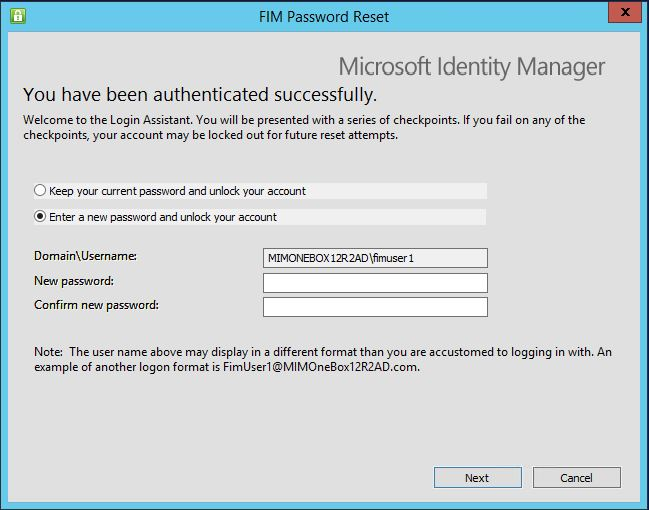

---

title: Working with Self-Service Password Reset | Microsoft Docs
description: See what's new with Self-Service Password Reset (SSPR) in MIM 2016, including how SSPR works with multifactor authentication.
keywords:
author: billmath
ms.author: billmath
manager: amycolannino
ms.date: 09/14/2023
ms.topic: article
ms.service: microsoft-identity-manager

ms.assetid: 94a74f1c-2192-4748-9a25-62a526295338

---

# Self-Service Password Reset deployment options

> [!IMPORTANT]
> In September 2022, Microsoft announced deprecation of Azure Multi-Factor Authentication Server. Beginning September 30, 2024, Azure Multi-Factor Authentication Server deployments no longer services multifactor authentication (MFA) requests. Customers of Azure Multi-Factor Authentication Server must move to instead use either custom MFA providers with MIM SSPR, or Microsoft Entra SSPR instead of MIM SSPR.

For new customers who are [licensed for Microsoft Entra ID P1 or P2](/azure/active-directory/authentication/concept-sspr-licensing), we recommend using [Microsoft Entra self-service password reset](/azure/active-directory/authentication/concept-sspr-howitworks) to provide the end-user experience. Microsoft Entra self-service password reset provides both a web-based and Windows-integrated experience for a user to reset their own password, and supports many of the same capabilities as MIM, including alternate email and Q&A gates. When deploying Microsoft Entra self-service password reset, you can configure Microsoft Entra Connect to [write back the new passwords to AD DS](/azure/active-directory/authentication/concept-sspr-writeback), and MIM [Password Change Notification Service](deploying-mim-password-change-notification-service-on-domain-controller.md) can be used to forward the passwords to other systems, such as another vendor's directory server. Deploying MIM for [password management](infrastructure/mim2016-password-management.md) does not require the MIM Service or the MIM self-service password reset or registration portals to be deployed. Instead, you can follow these steps:

- First, if you need to send passwords to directories other than Microsoft Entra ID and AD DS, deploy MIM Sync with connectors to Active Directory Domain Services and any additional target systems, configure MIM for [password management](infrastructure/mim2016-password-management.md) and deploy the [Password Change Notification Service](deploying-mim-password-change-notification-service-on-domain-controller.md).
- Then, if you need to send passwords to directories other than Microsoft Entra ID, configure Microsoft Entra Connect for [writing back the new passwords to AD DS](/azure/active-directory/authentication/concept-sspr-writeback).
- Optionally, [pre-register users](/azure/active-directory/authentication/howto-sspr-authenticationdata).
- Finally, [roll out Microsoft Entra self-service password reset to your end users](/azure/active-directory/authentication/howto-sspr-deployment).

For Forefront Identity Manager (FIM) or MIM customers licensed for Microsoft Entra ID P1 or P2, we recommend planning to transition to Microsoft Entra self-service password reset. You can transition end users to Microsoft Entra self-service password reset without needing them to re-register, by [synchronizing or setting through PowerShell a user's alternate email address or mobile phone number](/azure/active-directory/authentication/howto-sspr-authenticationdata). After users are registered for Microsoft Entra self-service password reset, the FIM password reset portal can be decommissioned.

MIM 2016 deployments that were using Microsoft Entra MFA should move to either using MIM SSPR with a custom MFA provider, or [Microsoft Entra self-service password reset](/azure/active-directory/authentication/concept-sspr-howitworks). New deployments should use either a custom MFA provider or [Microsoft Entra self-service password reset](/azure/active-directory/authentication/concept-sspr-howitworks).

## Deploying MIM Self-Service Password Reset Portal using a custom provider for multifactor authentication

The following section describes how to deploy MIM self-service password reset portal, using a provider for multifactor authentication. These steps are only necessary for customers who are not using Microsoft Entra self-service password reset for their users.

With MFA, users authenticate via the external provider in order to verify their identity while trying to regain access to their account and resources. Authentication can be via SMS or via telephone call. The stronger the authentication, the higher the confidence that the person trying to gain access is indeed the real user who owns the identity. Once authenticated, the user can choose a new password to replace the old one.

## Prerequisites to set up self-service account unlock and password reset using MFA

This section assumes that you have downloaded and completed the deployment of the Microsoft Identity Manager 2016 [MIM Sync, MIM Service and MIM Portal components](microsoft-identity-manager-deploy.md), including the following components and services:

-   An Active Directory Domain Controller with a designated domain (a 'corporate' domain)

-   A Group Policy is defined for Account lockout

-   MIM 2016 Synchronization Service (Sync) is installed and running on a server that is domain-joined to the AD domain

-   MIM 2016 Service &amp; Portal including the SSPR Registration Portal and the SSPR Reset Portal, are installed and running on a server (could be co-located with Sync)

-   MIM Sync is configured for AD-MIM identity synchronization, including:

    -   Configuring the Active Directory Management Agent (ADMA) for connectivity to AD DS and run profiles to import identity data from and export it to Active Directory.

    -   Configuring the MIM Management Agent (MIM MA) for connectivity to FIM Service database and run profiles to import identity data from and export it to the FIM database.

    -   Configuring Synchronization Rules in the MIM Portal to allow user data synchronization and facilitate sync-based activities in the MIM Service.

-   MIM 2016 Add-ins &amp; Extensions including the SSPR Windows Login integrated client is deployed on the server or on a separate client computer.

## Prepare MIM to work with MFA
Configure MIM Sync to Support Password Reset and Account Unlock Functionality. For more information, see [Installing the FIM Add-ins and Extensions](https://technet.microsoft.com/library/ff512688%28v=ws.10%29.aspx), [Installing FIM SSPR](https://technet.microsoft.com/library/hh322891%28v=ws.10%29.aspx), [SSPR Authentication Gates](https://technet.microsoft.com/library/jj134288%28v=ws.10%29.aspx), and [the SSPR Test Lab Guide](https://technet.microsoft.com/library/hh826057%28v=ws.10%29.aspx).

#### Configure the Phone gate or the One-Time Password SMS Gate

1.  Launch Internet Explorer and navigate to the MIM Portal, authenticating as the MIM administrator, then click on  **Workflows** in the left hand navigation bar.

    

2.  Check **Password Reset AuthN Workflow**.

    

3.  Click on the **Activities** tab and then scroll down to **Add Activity**.

4.  Select **Phone Gate** or  **One-Time Password SMS Gate** click **Select** and then **OK**.

    > [!NOTE]
    > If using another provider which generates the one-time password itself, ensure the length field configured is the same length as that generated by the MFA provider.

Users in your organization can now register for password reset. During this process, they will enter their work phone number or mobile phone number so the system knows how to call them (or send them SMS messages).

#### Register users for password reset

1.  A user will launch a web browser and navigate to the MIM Password Reset Registration Portal. (Typically this portal will be configured with Windows authentication). Within the portal, they will provide their username and password again to confirm their identity.

    They need to enter the Password Registration Portal and authenticate using their username and password.

2.  In the **Phone Number** or **Mobile Phone**  field, they have to enter a country code, a space, and the phone number and click **Next**.

    

    

## How does it work for your users?
Now that everything is configured and it’s running, you might want to know what your users are going to have to go through when they reset their passwords right before a vacation and come back only to realize that they completely forgot their passwords.

There are two ways a user can use the password reset and account unlock functionality, either from the Windows sign-in screen, or from the self-service portal.

By installing the MIM Add-ins and Extensions on a domain joined computer connected over your organizational network to the MIM Service, users can recover from a forgotten password at the desktop login experience. The following steps walk you through the process.

#### Windows desktop login integrated password reset

1.  If your user enters the wrong password several times, in the sign-in screen, they will have the option to click **Problems logging in?** .

    

    Clicking this link will take them to the MIM Password Reset screen where they can change their password or unlock their account.

    

2.  The user will be directed to authenticate. If MFA was configured, the user will receive a phone call.

3.  In the background, what’s happening is that the MFA provider then places a phone call to the number the user gave when that user signed up for the service.

4.  When a user answers the phone, they may be asked to interact, for example, to press the pound key # on the phone. Then the user clicks **Next** in the portal.

    If you set up other gates as well, the user will be asked to provide more information in subsequent screens.

    > [!NOTE]
    > If the user is impatient and clicks **Next** before pressing the pound key #, authentication fails.

5.  After successful authentication, the user will be given two options, either unlock the account and keep the current password or to set a new password.

6.  Then the user has to enter a new password twice, and the password is reset.

#### Access from the self-service portal

1.  Users can open a web browser, navigate to the **Password Reset Portal** and enter their username and click **Next**.

    If MFA was configured, the user will receive a phone call. In the background, what’s happening is that Microsoft Entra multifactor authentication then places a phone call to the number the user gave when they signed up for the service.

    When a user answers the phone, they will be asked to press the pound key # on the phone. Then the user clicks **Next** in the portal.

2.  If you set up other gates as well, the user will be asked to provide more information in subsequent screens.

    > [!NOTE]
    > If the user is impatient and clicks **Next** before pressing the pound key #, authentication fails.

3.  The user will have to choose if they want to reset their password or unlock their account. If they choose to unlock their account, the account will be unlocked.

    

4.  After successful authentication, the user will be given two options, either to keep their current password or to set a new password.

5.  

6.  If the user chooses to reset their password, they will have to type in a new password twice and click **Next** to change the password.
